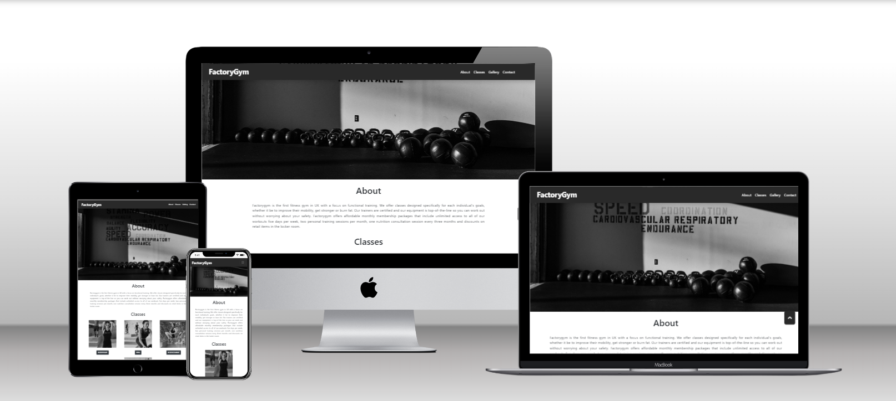
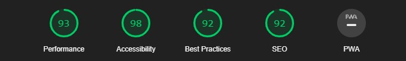
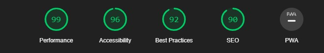
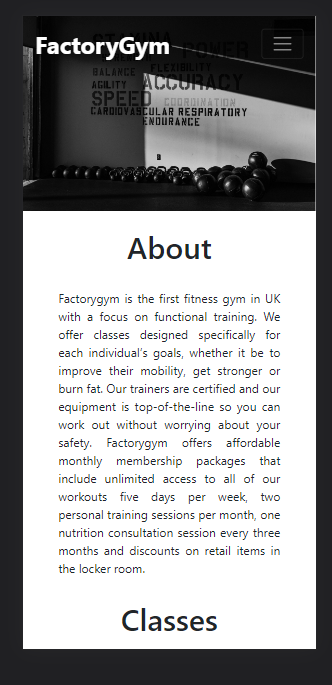
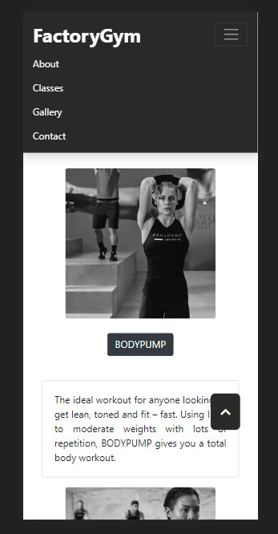
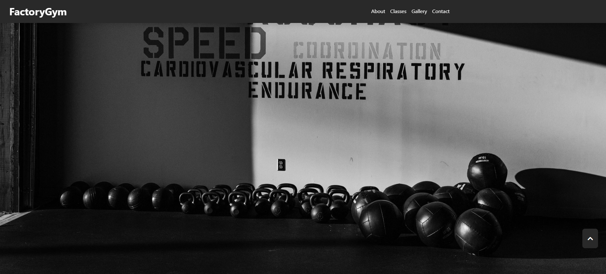
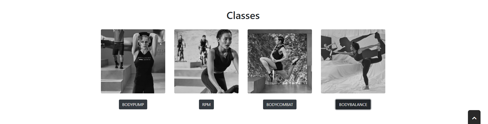
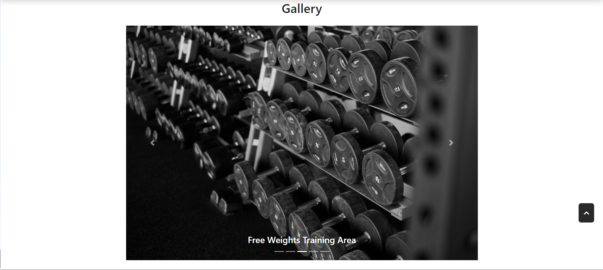
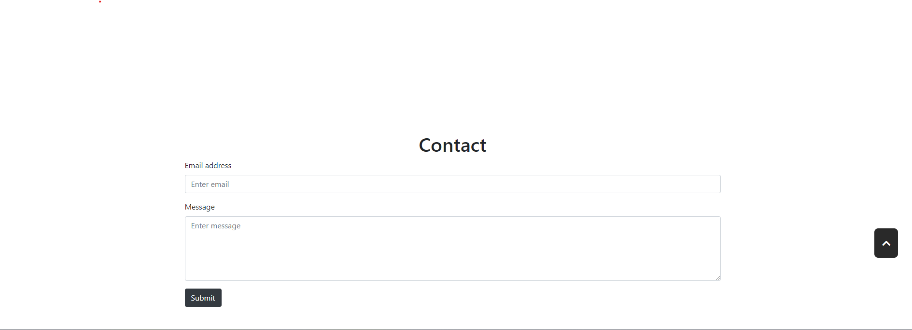
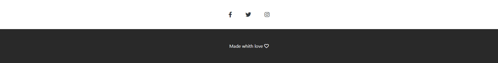

# FactoryGym

The FactoryGym website aims to provide a platform for fitness enthusiasts in the UK to access a unique fitness experience centered around functional training. It offers a range of classes and services designed to help individuals achieve their fitness goals, improve their overall well-being, and promote a healthy lifestyle. The site serves as a digital presence for FactoryGym, allowing users to learn about the gym, explore available classes, view the facility's gallery, and get in touch for inquiries or membership.

User Stories:

# Table of Contents
* [UX](#ux "UX")
    * [User Goals](#user-goals "User Goals")
    * [User Stories](#user-stories "User Stories")
    * [Site Owners Goals](#site-owners-goals)
    * [User Requirements and Expectations](#user-requirements-and-expectations)
         * [Requirements](#requirements)
         * [Expectations](#expectations)
     * [Design Choices](#design-choices)
        * [Fonts](#fonts)
        * [Icons](#icons)
        * [Colours](#colours)
        * [Structure](#structure)
    * [Wireframes](#wireframes)
    * [Features](#features)
        * [Existing Features](#existing-features)
            * [Navigation Bar](#navigation-bar)
            * [Landing Page](#landing-page)
            * [About Section](#about-section)
            * [Classes Section](#classes-section)
            * [Gallery Section](#gallery-section)
            * [Contact Section](#contact-section)
            * [Footer](#footer)
        * [Features to be implemented](#features-to-be-implemented)
    * [Technologies used](#technologies-used)
        * [Languages](#languages)
        * [Tools and Libraries](#tools-and-libraries)
    * [Testing](#testing)
        * [Unfixed Bugs](#unfixed-bugs)
    * [Deployment](#deployment)
    * [Credits](#credits)
* Ux

## User Goals
* Visually appealing, including images.
* Easily navigated around.
* Quality and valuable content.
* Easily found contact details.
* Form to directly contact the Gym.

## User Stories
* As a user, I want to learn about FactoryGym and understand its unique approach to fitness training.
* As a user, I want to browse the available classes and find one that aligns with my fitness goals and interests.
* As a user, I want to see images of the gym's facilities and training areas to get an idea of the environment.
* As a user, I want to have easy access to contact information, so I can reach out to the gym for inquiries or membership details.
* As a user, I want to have the option to submit my email and send a message to the gym for further information.
* As a user, I want to navigate easily through the website and have a smooth browsing experience.
* As a user, I want to stay connected with FactoryGym by following their social media accounts for updates and promotions.

## Site Owners Goals
* Promote the Gym.
* Increase the number of members.
* Increase rankings on search engines.

## Requirements
* Easy to navigate on various screen sizes.
* Clear information what the Gym has to offers.
* Keep the user interested with small bits of information to make them want to engage with the Gym.
* Simple methods of contacting the Gym.
* Apelative so users do not leave.

## Expectations
* I expect to know if a form has been submitted properly and if items are not filled in, to be prompted.
* I expect all links to social media sites to be opened in a new tab.
* I expect all navigation links to work correctly.
* I expect screen size not to affect the quality of the website.
* I expect all information to be correct and accurate.

# Design Choices

## Fonts
In order to move away from the basic fonts available, I have used 
[Google Fonts](https://fonts.google.com/ "Google Fonts") 
to find a text that best suits the feel of the website.
 For the main text I have chosen 
 [Exo](https://fonts.google.com/specimen/Exo?query=mon "Exo") 
 as I feel it is has a sharp, simple and easy to read look. 
 To make the headers and the navigation bar stand out form the text, 
 I decided to use 
 [Roboto](https://fonts.google.com/specimen/Roboto?query=rob "Roboto").
 
 ## Icons
 
I will used some icons for my website from the Font Awesome library. These icons will only be used where there is no explination needed to their meaning, social media links, contact links and a hamburger for navigational links on smaller devices. All icons used will be styled and in keeping with the appearance of the website.

I will explain the uses of the varius colours below, starting from top to bottom.

## Colours

 * #292929 - This colour will be used as navbarand footer background colour submit buttom color and text content  Color.

 * #616161 - This colour will be used on the "back to the top" buttom as hover colour .

 * #FFFFFF - This colour will be used as a background colour, Navbar and Footer as a text colour.

## Wireframes
I have used [Balsamic](https://balsamiq.com/wireframes/ "Balsamic") to develop my wireframes for my website. I initially created the mobile version and then the wireframes and then scalled it up for both tablet and desktop. Because a requirement is to give little but quality information to the user to make them want to engage with the club, a one-page website is used. This gets the user through the content and quickly to the contact form and details via scrolling or directly via the navigation bar.

The wireframes are below:

###   [desktop view](Wireframes/desktopview.png)

###   [phone view](Wireframes/phoneview.png)

###   [tablet view](Wireframes/tabletview.png)

## Structure
The website is designed with a responsive structure using Bootstrap breakpoints, ensuring an excellent user experience across various devices and screen sizes. The website follows a well-organized structure, consisting of different sections that adapt seamlessly to different screen dimensions.

| Screen Size | Breakpoint |
| ----------- | ---------- |
| x-small     | <576px     |
| small       | => 576px   |
| medium      | => 768px   |
| large       | => 992px   |
| x-large     | => 1200px  |

# Deployment

Following writing the code then commiting and pushing to GitHub, this project was deployed using GitHub by the following steps.

+ Navigate to the repository on github and click 'Settings'.
+ Then select 'Pages' on the side navigation.
+ Select the 'None' dropdown, and then click 'master'.
+ Click on the 'Save' button.
+ Now the website is now live on https://emanuelcaires.github.io/Factorygym/
+ If any changes are required, they can be done, commited and pushed to GitHub and the changes will be updated.

# Testing

### Lighthouse Mobile testing 

### Lighthouse Desktop testing 

Testing and Bug Evaluation:

During the development and testing phase of the FactoryGym website, thorough testing was conducted to identify and address any bugs or issues that could affect the functionality or user experience. The testing process involved various scenarios and user interactions to ensure the website performs as expected. Below is a summary of the testing process, along with the evaluation of bugs found and their fixes:

1. Responsive Design Testing:
   - Tested the website on different devices (desktop, tablets, mobile) and screen sizes to ensure responsive design.
   - Bug: The navigation menu was not collapsing properly on smaller screen sizes.
   - Fix: Updated the CSS and JavaScript code to ensure proper collapsing and expansion of the navigation menu.

2. Navigation Testing:
   - Tested all navigation links to different sections of the website.
   - Bug: The "Go to top" button was not functioning correctly.
   - Fix: Added JavaScript code to scroll to the top of the page when the button is clicked.

3. Form Validation Testing:
   - Tested the email input field and message textarea for form validation.
   - Bug: The form could be submitted without entering a valid email address or a message.
   - Fix: Implemented front-end form validation using JavaScript to ensure the required fields are filled out correctly before submission.

4. Class Information Display Testing:
   - Tested the "BODYPUMP," "RPM," "BODYCOMBAT," and "BODYBALANCE" class sections.
   - Bug: The class descriptions were not expanding/collapsing when clicking the buttons.
   - Fix: Corrected the data-toggle and data-target attributes in the HTML code to enable proper expansion and collapsing of class descriptions.

5. Carousel Testing:
   - Tested the image carousel in the gallery section.
   - Bug: The carousel controls (previous and next buttons) were not functioning correctly.
   - Fix: Adjusted the carousel control code to enable proper sliding of images when the buttons are clicked.

6. Social Media Links Testing:
   - Tested the social media links in the footer section.
   - Bug: The social media links were not directing users to the correct external websites.
   - Fix: Updated the href attributes of the social media links with the correct URLs.

Evaluation of Unfixed Bugs:
- No unfixed bugs were identified during the testing process. All bugs encountered were addressed and fixed accordingly.

Overall, thorough testing and bug fixes were performed to ensure the FactoryGym website functions correctly and provides a seamless user experience.
&nbsp;

# Tech Stacks

## Languages
* [HTML](https://en.wikipedia.org/wiki/HTML "HTML")
* [CSS](https://en.wikipedia.org/wiki/CSS "CSS")
* [JS](https://en.wikipedia.org/wiki/JavaScript "JAVASCRIP")
## Libraries & Framework
* [Google Fonts](https://fonts.google.com/ "Google Fonts")
* [Font Awesome library](https://fontawesome.com/ "Font Awesome")
## Tools
* [Gitpod](https://www.gitpod.io/ "Gitpod")
* [Balsamic](https://balsamiq.com/wireframes/ "Balsamic")
* [W3C HTML Validation Service](https://validator.w3.org/ "W3C HTML")
* [W3C CSS Validation Service](https://jigsaw.w3.org/css-validator/ "W3C CSS")
* [Bootstrap](https://getbootstrap.com "Bootstrap")
* [Font Awesome library](https://fontawesome.com/ "Font Awesome")
* [Google Fonts](https://fonts.google.com/ "Google Fonts")
# Features

## Existing Features

### Navigation Bar

+ The navigation bar is fully responsive to allow for various screen sizes. It includes links to manover around the site easily and the Gym logo which doubles as a link back to the home screen.

+ Small devices (<992px)

+ As the navigation bar would be unuseable in the desktop version on smaller devices, it takes on a hamburger style.

### Landing Page

+ The landing page image gives the user instant knowledge of what is involved in the Gym amd a good motivation to scroll down to find out more.

### About Section

+ The about section gives a description of the type of classes, membership prices and some offers that will find at the Gym.
+ It is also responsive to suit the different screen sizes.
 

### Classes Section

+ The classes section gives am idea about the type of classesexiste at the Gym  and a dropdown buttom, when pressed  open up with small descripition of class.

### Gallery Section

+ The gallery section show a slideshow of pictures of the Gym.

### Contact Section

+ The contact section allows the user to quickly send a message to the Gym.

### Footer Section

+ The footer contains the social media links related to Gym.
+ These social links all open in a new tab for ease of use to the user and also, so the user has an ability to easily come back to Gym's site.
 

# Credits

For code insperation, help and advice,
* [Simen Daehlin](https://github.com/Eventyret "Simen Daehlin")

For Content and style insperation,
* [Pexels](https://www.pexels.com/)
* [convertimage](https://convertimage.net/index.asp)
* [Les Miles](https://www.lesmills.com/)
* [Jasper](https://www.jasper.ai/)
